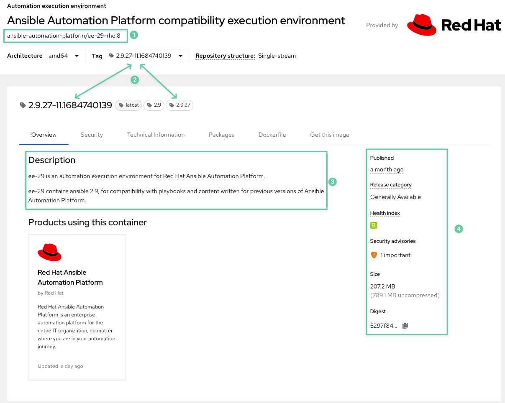
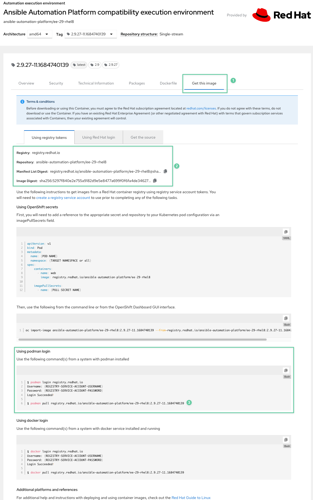
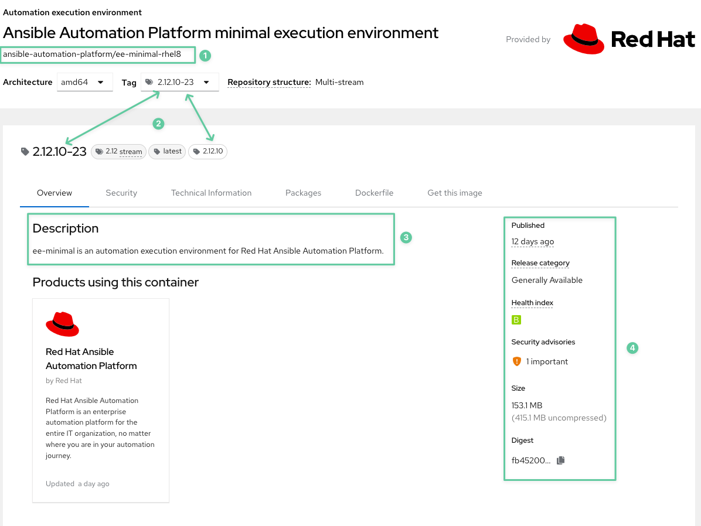
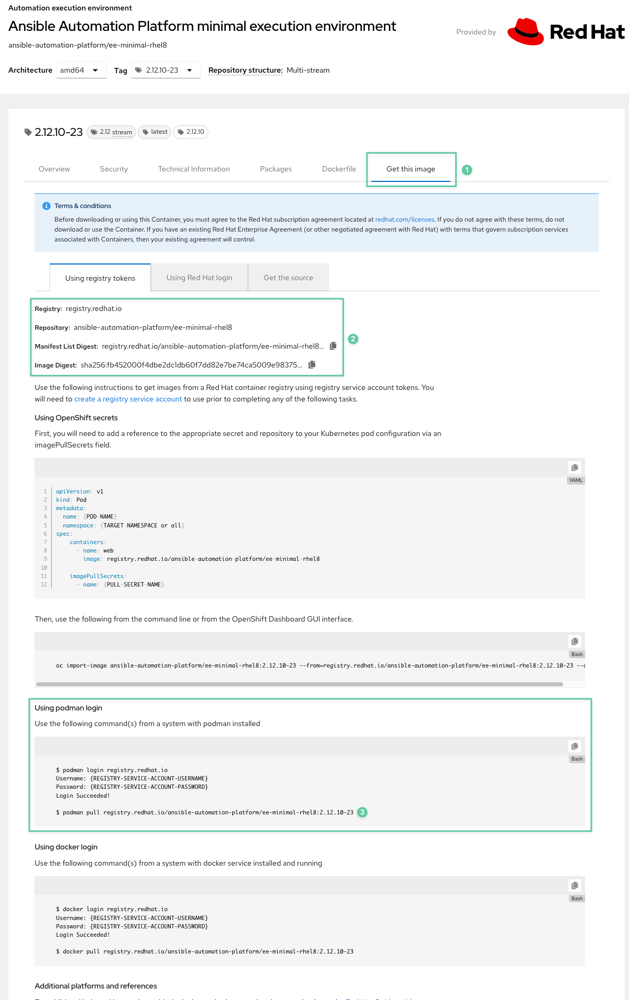
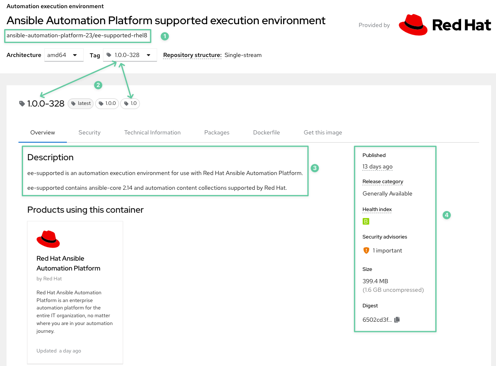
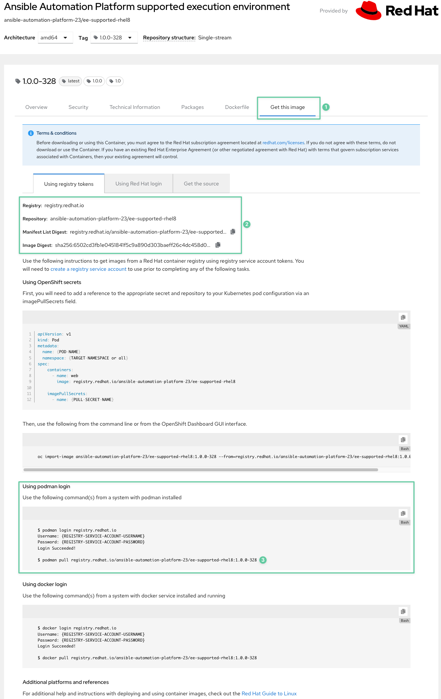

# Workshop Exercise - Exploring Execution Environments

**Read this in other languages**:
<br> [English](README.md),  [日本語](README.ja.md),  [Portugues do Brasil](README.pt-br.md),  [Française](README.fr.md), [Español](README.es.md).

## Table of Contents

- [Workshop Exercise - Exploring Execution Environments](#workshop-exercise---exploring-execution-environments)
  - [Table of Contents](#table-of-contents)
  - [Objective](#objective)
  - [Guide](#guide)
    - [Step 1 - Use Automation Execution Environments](#step-1---use-automation-execution-environments)
      - [Inspect Automation Execution Environments](#inspect-automation-execution-environments)
      - [Using Automation Execution Environments](#using-automation-execution-environments)
        - [Use case: Playbook with previous version of Ansible](#use-case-playbook-with-previous-version-of-ansible)
        - [Use case: Playbook with collections not included on the Execution Environment](#use-case-playbook-with-collections-not-included-on-the-execution-environment)
    - [Step 2 - Build Automation Execution Environments](#step-2---build-automation-execution-environments)
      - [Deciding When to Create a Custom Automation Execution Environment](#deciding-when-to-create-a-custom-automation-execution-environment)
      - [Preparing for a New Automation Execution Environment](#preparing-for-a-new-automation-execution-environment)
        - [Ansible Content Collections to Install with `requirements.yml`](#ansible-content-collections-to-install-with-requirementsyml)
        - [Python Packages to Install with `requirements.txt`](#python-packages-to-install-with-requirementstxt)
        - [RPM Packages to Install with `bindep.txt`](#rpm-packages-to-install-with-bindeptxt)
      - [Building a New Automation Execution Environment](#building-a-new-automation-execution-environment)
      - [Building a Automation Execution Environment with custom Ansible Content Collections](#building-a-automation-execution-environment-with-custom-ansible-content-collections)
    - [Takeaways](#takeaways)

## Objective

This exercise will help users understand how to identify the Automation Execution Environments and select the correct one for your use case.

An **Automation Execution Environment* is a container image that includes Ansible Content Collections, their software dependencies, and a minimal Ansible engine that can run your playbooks.
By using an automation Execution Environment, you can use the same consistent, portable environment to develop your Ansible Playbooks on one system and run them on another. This streamlines and simplifies the development process and helps to ensure predictable, reproducible results.

The automation execution environment is where your Ansible Playbook actually runs. You normally use a tool such as `ansible-navigator` to run a playbook, but the playbook runs inside the container rather than directly on your system.

An automation execution environment consists of the following:

- Ansible Core (or Ansible).
- Ansible Content Collections to supplement Ansible Core.
- Python and any other dependencies of Ansible Core and the included collections.
- Ansible Runner to run your playbooks.

## Guide

### Step 1 - Use Automation Execution Environments

#### Inspect Automation Execution Environments

1. Use the automation content navigator to list and inspect the automation execution environments available on the system. To do so, run the `ansible-navigator images` command:

```bash
[student@ansible-1 ~]$ ansible-navigator images

  Image                                                                           Tag                                       Execution environment                                                                        Created                                               Size
0│ee-supported-rhel8                                                              1.0.0-208                                 True                                                                                         6 months ago                                          1.66 GB


^b/PgUp page up                                       ^f/PgDn page down                                       ↑↓ scroll                                       esc back                                       [0-9] goto                                       :help help
```

From here, we can inspect the execution environment.
To select the existing Execution Environment, we need to press `**0**` to select the `ee-supported-rhel8`, and then pressing `**0**` again to select  `Image information`, that will show the details of the execution environment.

> **INFO**
>
> To exit from that menu, we can press `**ESC**` to return to the previous menu. Type `**:q**` and press `**Enter**` to exit the `ansible-navigator` command.

2. To check the collections or ansible information from the image, we should press `**ESC**` to return to the past screen and then press `**2**` to select `Ansible version and collections`

```bash
 0│---
 1│ansible:
 2│  collections:
 3│    details:
 4│      amazon.aws: 5.1.0
 5│      ansible.controller: 4.3.0
 6│      ansible.netcommon: 4.1.0
 7│      ansible.network: 1.2.0
 8│      ansible.posix: 1.3.0
 9│      ansible.security: 1.0.0
10│      ansible.snmp: 1.0.1
11│      ansible.utils: 2.7.0
12│      ansible.windows: 1.12.0
13│      ansible.yang: 1.0.0
14│      arista.eos: 6.0.0
15│      cisco.asa: 4.0.0
16│      cisco.ios: 4.1.0
17│      cisco.iosxr: 4.0.2
18│      cisco.nxos: 4.0.0
19│      cloud.common: 2.1.2
20│      frr.frr: 2.0.0
21│      ibm.qradar: 2.1.0
22│      junipernetworks.junos: 4.0.0
23│      kubernetes.core: 2.3.2
24│      openvswitch.openvswitch: 2.1.0
25│      redhat.insights: 1.0.7
26│      redhat.openshift: 2.2.0
27│      redhat.rhv: 2.1.0
28│      redhat.satellite: 3.3.0
29│      servicenow.itsm: 1.3.3
30│      splunk.es: 2.1.0
31│      trendmicro.deepsec: 2.0.0
32│      vmware.vmware_rest: 2.2.0
33│      vyos.vyos: 4.0.0
34│  version:
35│    details: ansible [core 2.14.1]
```

> **NOTE**
>
> The Execution Environment `ee-supported-rhel8` is providing us `ansible-core 2.14.1` and a set of Ansible Content Collections to work with, this image provides around 30 Ansible Content Collections.
>

To configure the default Execution Environment you can edit the file `~/.ansible-navigator.yml` for this specific environment looks like:

```yaml
---
ansible-navigator:
  ansible:
    inventory:
      entries:
      - /home/student/lab_inventory/hosts

  execution-environment:
    image: registry.redhat.io/ansible-automation-platform-23/ee-supported-rhel8:1.0.0-208
    enabled: true
    container-engine: podman
    pull:
      policy: missing
    volume-mounts:
    - src: "/etc/ansible/"
      dest: "/etc/ansible/"
```

> **NOTE**
>
> For more details in how to configure `ansible-navigator` visit the [link](https://ansible.readthedocs.io/projects/navigator/settings/#the-ansible-navigator-settings-file)
>

#### Using Automation Execution Environments

The `ansible-navigator run` command runs your playbooks in an automation Execution Environment, the default one is the one defined on the file `~/.ansible-navigator.yml`, but you can select a different one by specifying the `--execution-environment-image` (or `--eei`) option.

##### Use case: Playbook with previous version of Ansible

The following example shows how to run a playbook using the **Compatibility Automation Execution Environment**.
The **Compatibility Automation Execution Environment** contains `Ansible 2.9`, for compatibility with playbooks and content written for previous versions of Ansible Automation Platform.

1. Create an exercise directory named `~/ansible-ee/old-playbook`

```shell
[student@ansible-1 ~]$ mkdir -p ~/ansible-ee/old-playbook
[student@ansible-1 ~]$ cd ~/ansible-ee/old-playbook
```

1. Create a playbook named `old-playbook.yml`, that is using the old Ansible syntax.

```shell
[student@ansible-1 old-playbook]$ echo "---
- name: Update web servers
  hosts: web
  become: true

  tasks:
  - name: Ensure apache is at the latest version
    yum:
      name: httpd
      state: latest
  - name: Ensure the apache service is started and enabled
    systemd:
      name: httpd
      state: started
      enabled: true
  - name: Create a basic index.html
    copy:
      content: 'This is web node name: {{ inventory_hostname }} and IP Address: {{ ansible_host }}'
      dest: /var/www/html/index.html" > old-playbook.yml
```

> **NOTE**
>
> The tasks on the `old-playbook.yml` file are **NOT** using the FQCN (Full Qualify Collection Name) for the modules, that is the *old way* to write ansible playbooks, as the new method includes the FQCN for each module, for this example, to update the playbook the `yum` module should reads `ansible.builtin.yum` and `systemd` becomes `ansible.builtin.systemd`
>

3. The **Compatibility Automation Execution Environment** for this example is available in this [link](https://catalog.redhat.com/software/containers/ansible-automation-platform/ee-29-rhel8/6331f4f5c8ae8d70b75bfe28) for your review






4. The next command is going to download the Execution Environment image and then run the `old-playbook.yml` using the downloaded Execution Environment that uses an older version of ansible, in this case `Ansible 2.9`

```shell
[student@ansible-1 old-playbook]$ ansible-navigator run old-playbook.yml --eei registry.redhat.io/ansible-automation-platform-23/ee-29-rhel8:1.0 -m stdout
----------------------------------------------------------------------------------------------------
Execution environment image and pull policy overview
----------------------------------------------------------------------------------------------------
Execution environment image name:     registry.redhat.io/ansible-automation-platform-23/ee-29-rhel8:1.0
Execution environment image tag:      1.0
Execution environment pull arguments: None
Execution environment pull policy:    missing
Execution environment pull needed:    True
----------------------------------------------------------------------------------------------------
Updating the execution environment
----------------------------------------------------------------------------------------------------
Running the command: podman pull registry.redhat.io/ansible-automation-platform-23/ee-29-rhel8:1.0
Trying to pull registry.redhat.io/ansible-automation-platform-23/ee-29-rhel8:1.0...
Getting image source signatures
Checking if image destination supports signatures
Copying blob bcccb9fc293e done
Copying blob 2ad3b9180fba done
Copying blob 78159f5d6288 done
Copying blob 28ff5ee6facb done
Copying config 58c796a146 done
Writing manifest to image destination
Storing signatures
58c796a146e35be2d61a175abadeb5ad9a5f76189b7d9e4285ad1d56a52e3731

PLAY [Update web servers] ******************************************************

TASK [Gathering Facts] *********************************************************
ok: [node1]
ok: [node2]
ok: [node3]

TASK [Ensure apache is at the latest version] **********************************
changed: [node1]
changed: [node2]
changed: [node3]

TASK [Ensure the apachhe service is started and enabled] ***********************
changed: [node1]
changed: [node2]
changed: [node3]

PLAY RECAP *********************************************************************
node1                      : ok=3    changed=2    unreachable=0    failed=0    skipped=0    rescued=0    ignored=0
node2                      : ok=3    changed=2    unreachable=0    failed=0    skipped=0    rescued=0    ignored=0
node3                      : ok=3    changed=2    unreachable=0    failed=0    skipped=0    rescued=0    ignored=0
```

> **NOTE**
>
> As we don't have the Execution Environment `registry.redhat.io/ansible-automation-platform-23/ee-29-rhel8:1.0` in our system, the previous command downloaded it from the registry `registry.redhat.io` and now we can refer to that Execution Environment as `ansible-automation-platform-23/ee-29-rhel8:1.0` or `ee-29-rhel8`
> Example:
> ```shell
> [student@ansible-1 old-playbook]$ ansible-navigator run old-playbook.yml --eei ee29-rhel8 -m stdout
>```

> **NOTE**
>
> If the Execution Environment is not already available on your system, `ansible-navigator` tries to pull it from the container registry. You need to make sure that you are authenticated to that registry with the `podman login` command first. In the preceding example, at the beginning of your session, run the `podman login registry.redhat.io` command and provide your Customer Portal credentials to authenticate to the registry.
>

5. We can confirm that the playbook run successfully running the command:

```shell
for i in {1..3}; do curl node$i -w "\n"; done
This is web node name: node1 and IP Address: 18.191.157.126
This is web node name: node2 and IP Address: 3.141.45.107
This is web node name: node3 and IP Address: 52.15.98.115
```

6. Back to the Execution Environment, lets confirm that indeed we used `ansible 2.9.27` to run the previous command, for that we can run:

```shell
[student@ansible-1 old-playbook]$ ansible-navigator images
Image                                                                           Tag                                       Execution environment                                                                        Created                                               Size
0│ee-29-rhel8                                                                     1.0                                       True                                                                                         12 days ago                                           888 MB
1│ee-supported-rhel8                                                              1.0.0-208                                 True                                                                                         6 months ago                                          1.66 GB


^b/PgUp page up                                 ^f/PgDn page down                                 ↑↓ scroll                                 esc back                                 [0-9] goto                                 :help help
```

Then press `**0**` to select the Execution Environment `ee-29-rhel8` and then `**2**` to select `Ansible version and collections`

```shell
 0│---
 1│ansible:
 2│  collections:
 3│    details: This command is not supported with ansible 2.9.
 4│    errors:
 5│    - |-
 6│      usage: ansible-galaxy collection [-h] COLLECTION_ACTION ...
 7│      ansible-galaxy collection: error: argument COLLECTION_ACTION: invalid choice: 'list' (choose from 'init', 'build', 'publish', 'install')
 8│  version:
 9│    details: ansible 2.9.27
```

> **NOTE**
>
> That the Execution Environment Image `ee-29-rhel8` is providing us `ansible 2.9.27` and **NO** collections at all.

> **NOTE**
>
> Instead of using the `--eei` option, you can create an `ansible-navigator.yml` configuration file to define the automation execution environment to use by default.

> **WARNING**
>
> For this example, the default Execution Environment can also run the deprecated playbook, however, eventually that option wouldn't be there

##### Use case: Playbook with collections not included on the Execution Environment

The following example shows how to find a Execution Environment that includes the required Ansible Content Collections that we need for our projects

1. Create an exercise directory named `~/ansible-ee/acl-playbook`

```shell
[student@ansible-1 ~]$ mkdir -p ~/ansible-ee/acl-playbook
[student@ansible-1 ~]$ cd ~/ansible-ee/acl-playbook
```

2. Create a playbook named `acl-playbook.yml`

```shell
[student@ansible-1 acl-playbook]$ echo "---
- name: Retrieving ACLs using the ansible.posix collection
  hosts: web
  gather_facts: false
  tasks:
    - name: Obtain the ACLs for /var/www/html directory
      ansible.posix.acl:
        path: /var/www/html
      register: acl_info
    - name: Print the ACLs obtained for /var/www/html directory
      ansible.builtin.debug:
        var: acl_info.acl" > acl-playbook.yml
```

3. Identify the modules that the playbook uses.

- ansible.posix.acl
- ansible.builtin.debug

To successfully run the playbook, you need the `ansible.posix.acl` module, which is part of the `ansible.posix` Ansible Content Collection in the Execution Environment.

> **NOTE**
>
> Use the `podman login` command to log in to the private automation hub at `registry.redhat.io` if you haven't done yet.
>
> `podman login registry.redhat.io`

3. The **Minimal Automation Execution Environment** for this step is available in this [link](https://catalog.redhat.com/software/containers/ansible-automation-platform/ee-minimal-rhel8/62bd87442c0945582b2b4b37) for your review






4. Use the `ansible-navigator images` command to pull the **Minimal Execution Environment** and analyze it.

```shell
[student@ansible-1 acl-playbook]$ ansible-navigator images --eei ansible-automation-platform/ee-minimal-rhel8:2.14
------------------------------------------------------------------------------------
Execution environment image and pull policy overview
------------------------------------------------------------------------------------
Execution environment image name:     ansible-automation-platform/ee-minimal-rhel8:2.14
Execution environment image tag:      2.14
Execution environment pull arguments: None
Execution environment pull policy:    missing
Execution environment pull needed:    True
------------------------------------------------------------------------------------
Updating the execution environment
------------------------------------------------------------------------------------
Running the command: podman pull ansible-automation-platform/ee-minimal-rhel8:2.14
Resolved "ansible-automation-platform/ee-minimal-rhel8" as an alias (/etc/containers/registries.conf.d/001-rhel-shortnames.conf)
Trying to pull registry.redhat.io/ansible-automation-platform/ee-minimal-rhel8:2.14...
Getting image source signatures
Checking if image destination supports signatures
Copying blob b3cd148e9e0a done
Copying blob d2b5f358ecf1 done
Copying blob 4104854ab26c done
Copying blob f6ce0e898c3a done
Copying config ab66adc818 done
Writing manifest to image destination
Storing signatures
ab66adc818632fb4046f579ba8c65a0a186b51be88e5335dea1ae7a8aa11d797

  Image                                                                           Tag                                       Execution environment                                                                        Created                                               Size
0│ee-29-rhel8                                                                     1.0                                       True                                                                                         12 days ago                                           888 MB
1│ee-minimal-rhel8                                                                2.14                                      True                                                                                         3 weeks ago                                           306 MB
2│ee-supported-rhel8                                                              1.0.0-208                                 True                                                                                         6 months ago                                          1.66 GB


^b/PgUp page up                                       ^f/PgDn page down                                       ↑↓ scroll                                       esc back                                       [0-9] goto                                       :help help
```

5. Press `**1**` to inspect this Execution Environment(`ee-minimal-rhel8`). Then, press `**2**` to select the **Ansible version and collections** option.

```
0│---
1│ansible:
2│  collections:
3│    details: {}
4│    errors:
5│    - |-
6│      ERROR! - None of the provided paths were usable. Please specify a valid path with --collections-path
7│  version:
8│    details: ansible [core 2.14.6]
```

6. The resulting screen indicates that the Minimal Execution Environment **does not** contain any additional Ansible Content Collections and it is providing `Ansible Core 2.14.6`.

7. Type `:q` and press `Enter` to exit the `ansible-navigator` command.

The `ee-minimal-rhel8` Execution Environment **is not useful for run the `acl-playbook.yaml` playbook**.

8. The **Supported Automation Execution Environment** for this step is available in this [link](https://catalog.redhat.com/software/containers/ansible-automation-platform-23/ee-supported-rhel8/62c7060bc1d77e67d5893a78) for your review





8. Use the `ansible-navigator` command to pull down and inspect the **Supported Automation Execution Environment**.

```shell
[student@ansible-1 acl-playbook]$ ansible-navigator images --eei registry.redhat.io/ansible-automation-platform-23/ee-supported-rhel8:1.0
-----------------------------------------------------------------------------------------------------------
Execution environment image and pull policy overview
-----------------------------------------------------------------------------------------------------------
Execution environment image name:     registry.redhat.io/ansible-automation-platform-23/ee-supported-rhel8:1.0
Execution environment image tag:      1.0
Execution environment pull arguments: None
Execution environment pull policy:    missing
Execution environment pull needed:    True
-----------------------------------------------------------------------------------------------------------
Updating the execution environment
-----------------------------------------------------------------------------------------------------------
Running the command: podman pull registry.redhat.io/ansible-automation-platform-23/ee-supported-rhel8:1.0
Trying to pull registry.redhat.io/ansible-automation-platform-23/ee-supported-rhel8:1.0...
Getting image source signatures
Checking if image destination supports signatures
Copying blob d2b5f358ecf1 skipped: already exists
Copying blob debf4e5df458 done
Copying blob 749eb51af9d8 done
Copying blob 4029f3faeb45 done
Copying config 36a5c93b87 done
Writing manifest to image destination
Storing signatures
36a5c93b87ddb436b21eccc41a55c81b79e550525754c1af2d2323bd5a4b21b3

 Image                                                                           Tag                                       Execution environment                                                                        Created                                               Size
0│ee-29-rhel8                                                                     1.0                                       True                                                                                         12 days ago                                           888 MB
1│ee-minimal-rhel8                                                                2.14                                      True                                                                                         3 weeks ago                                           306 MB
2│ee-supported-rhel8                                                              1.0                                       True                                                                                         12 days ago                                           1.68 GB
3│ee-supported-rhel8                                                              1.0.0-208                                 True                                                                                         6 months ago                                          1.66 GB


^b/PgUp page up                                       ^f/PgDn page down                                       ↑↓ scroll                                       esc back                                       [0-9] goto                                       :help help
```

8. Press `**2**` to inspect the `ee-supported-rhel8:1.0` Execution Environment. Then, press `**2**` to select the **Ansible version and collections** option.

```shell
 0│---
 1│ansible:
 2│  collections:
 3│    details:
 4│      amazon.aws: 5.1.0
 5│      ansible.controller: 4.3.0
 6│      ansible.netcommon: 4.1.0
 7│      ansible.network: 1.2.0
 8│      ansible.posix: 1.3.0
 9│      ansible.security: 1.0.0
10│      ansible.snmp: 1.0.1
11│      ansible.utils: 2.7.0
12│      ansible.windows: 1.12.0
13│      ansible.yang: 1.0.0
14│      arista.eos: 6.0.0
15│      cisco.asa: 4.0.0
16│      cisco.ios: 4.4.0
17│      cisco.iosxr: 5.0.0
18│      cisco.nxos: 4.1.0
19│      cloud.common: 2.1.2
20│      frr.frr: 2.0.0
21│      ibm.qradar: 2.1.0
22│      junipernetworks.junos: 4.0.0
23│      kubernetes.core: 2.3.2
24│      openvswitch.openvswitch: 2.1.0
25│      redhat.insights: 1.0.7
26│      redhat.openshift: 2.2.0
27│      redhat.rhv: 2.1.0
28│      redhat.satellite: 3.3.0
29│      servicenow.itsm: 1.3.3
30│      splunk.es: 2.1.0
31│      trendmicro.deepsec: 2.0.0
32│      vmware.vmware_rest: 2.2.0
33│      vyos.vyos: 4.0.0
34│  version:
35│    details: ansible [core 2.14.6]
```

9.  The resulting screen indicates that the **Supported Execution Environment** contains the `ansible.posix` Ansible Content Collection.

10. Type `:q` and press `Enter` to exit the `ansible-navigator` command.

The `ee-supported-rhel8` Execution Environment contains the `ansible.posix` Ansible Content Collection that you need. **You can run the prebuilt playbook using this Execution Environment.**

11. With what we have observed thus far, our hypothesis is that the **Minimal Execution Environment** won't work with the `acl-playbook.yml` because it does not include the `ansible.posix` Ansible Content Collection, or any other Ansible Content Collection. And the **Supported Execution Environment** includes the necessary `ansible.posix`  Ansible Content Collection to run successfully the `acl-playbook.yml` playbook.

12. Let's confirm our hypothesis. Use the `ansible-navigator` command to run the `acl-playbook.yml` playbook using the **Minimal Execution Environment**.

```shell
[student@ansible-1 acl-playbook]$ ansible-navigator run acl-playbook.yml -m stdout --eei ee-minimal-rhel8:2.14
ERROR! couldn't resolve module/action 'ansible.posix.acl'. This often indicates a misspelling, missing collection, or incorrect module path.

The error appears to be in '/home/student/acl_info.yml': line 6, column 7, but may
be elsewhere in the file depending on the exact syntax problem.

The offending line appears to be:

  tasks:
    - name: Obtain the ACLs for /var/www/html directory
      ^ here
Please review the log for errors.
```

As expected, the playbook cannot resolve the `ansible.posix.acl` module, causing it to fail.

13. Use the `ansible-navigator` command to run the `acl-playbook.yml` playbook using the `ee-supported-rhel8:1.0` Execution Environment.

```shell
[student@ansible-1 minimal-playbook]$ ansible-navigator run acl-playbook.yml -m stdout --eei ee-supported-rhel8:1.0

PLAY [Retrieving ACLs using the ansible.posix collection] **********************

TASK [Obtain the ACLs for /var/www/html directory] *****************************
ok: [node3]
ok: [node2]
ok: [node1]

TASK [Print the ACLs obtained for /var/www/html directory] *********************
ok: [node1] => {
    "acl_info.acl": [
        "user::rwx",
        "group::r-x",
        "other::r-x"
    ]
}
ok: [node2] => {
    "acl_info.acl": [
        "user::rwx",
        "group::r-x",
        "other::r-x"
    ]
}
ok: [node3] => {
    "acl_info.acl": [
        "user::rwx",
        "group::r-x",
        "other::r-x"
    ]****
}

PLAY RECAP *********************************************************************
node1                      : ok=2    changed=0    unreachable=0    failed=0    skipped=0    rescued=0    ignored=0
node2                      : ok=2    changed=0    unreachable=0    failed=0    skipped=0    rescued=0    ignored=0
node3                      : ok=2    changed=0    unreachable=0    failed=0    skipped=0    rescued=0    ignored=0
```

The **Supported Execution Environment** contains the `ansible.posix` Ansible Content Collection and the command succeeds.

### Step 2 - Build Automation Execution Environments

#### Deciding When to Create a Custom Automation Execution Environment

As we can see on the previous exercise, Red Hat provides several Ansible Execution Environments that suit the needs of many users. These Execution Environments include the most common Ansible Content Collections. The Execution Environments that Red Hat provides might be sufficient for your playbooks. In that case, you do not need to create new Execution Environments.

Sometimes, you might need an Ansible Content Collection that is not included in one of the existing Execution Environments. Often, you can install these extra collections in your Ansible project and then use an existing automation execution environment without having to build a new one.

On the other hand, you should consider creating a custom automation execution environment in the following situations:

- You frequently reuse specific collections that are not included in the existing automation execution environments. It is more efficient to embed those collections in a custom automation execution environment than to install them from the project `requirements.yml` file every time you run a playbook in that project. This is especially true if you have many projects that use that collection.
- The collection you want to use requires Python packages or software that are not included in an existing automation execution environment.
- You need to use a collection that conflicts with another collection in your existing automation execution environments.

You can use the `ansible-navigator images` command to inspect a container image and view the **collections**, **Python packages**, and **operating system packages** it includes every Execution Environment.

#### Preparing for a New Automation Execution Environment

You use the `ansible-builder` command to create the container images used for automation Execution Environments.
The **ansible-builder RPM package** provides that command.

1. Let's install the `ansible-builder` RPM package

```shell
[student@ansible-1 ~]$ sudo yum install ansible-builder
Updating Subscription Management repositories.
Last metadata expiration check: 2:14:57 ago on Fri 7 Apr 2023 12:49:39 PM UTC.
Dependencies resolved.
================================================================================================================================================================================================================================================================================================
 Package                                                                            Architecture                                                 Version                                                              Repository                                                           Size
================================================================================================================================================================================================================================================================================================
Installing:
 ansible-builder                                                                    noarch                                                       1.2.0-1.el8ap                                                        aap_installer                                                        51 k
Installing dependencies:
 python39-bindep                                                                    noarch                                                       2.10.2-3.el8ap                                                       aap_installer                                                        58 k
 python39-distro                                                                    noarch                                                       1.6.0-3.el8pc                                                        aap_installer                                                        34 k
 python39-parsley                                                                   noarch                                                       1.3-2.el8pc                                                          aap_installer                                                       176 k
 python39-pbr                                                                       noarch                                                       5.8.1-2.el8ap                                                        aap_installer                                                       148 k
 python39-requirements-parser                                                       noarch                                                       0.2.0-4.el8ap                                                        aap_installer                                                        20 k

Transaction Summary
================================================================================================================================================================================================================================================================================================
Install  6 Packages

Total size: 488 k
Installed size: 2.0 M
Is this ok [y/N]: y
Downloading Packages:
Running transaction check
Transaction check succeeded.
Running transaction test
Transaction test succeeded.
Running transaction
  Preparing        :                                                                                                                                                                                                                                                                        1/1
  Installing       : python39-requirements-parser-0.2.0-4.el8ap.noarch                                                                                                                                                                                                                      1/6
  Installing       : python39-pbr-5.8.1-2.el8ap.noarch                                                                                                                                                                                                                                      2/6
  Installing       : python39-parsley-1.3-2.el8pc.noarch                                                                                                                                                                                                                                    3/6
  Installing       : python39-distro-1.6.0-3.el8pc.noarch                                                                                                                                                                                                                                   4/6
  Installing       : python39-bindep-2.10.2-3.el8ap.noarch                                                                                                                                                                                                                                  5/6
  Installing       : ansible-builder-1.2.0-1.el8ap.noarch                                                                                                                                                                                                                                   6/6
  Running scriptlet: ansible-builder-1.2.0-1.el8ap.noarch                                                                                                                                                                                                                                   6/6
  Verifying        : ansible-builder-1.2.0-1.el8ap.noarch                                                                                                                                                                                                                                   1/6
  Verifying        : python39-bindep-2.10.2-3.el8ap.noarch                                                                                                                                                                                                                                  2/6
  Verifying        : python39-distro-1.6.0-3.el8pc.noarch                                                                                                                                                                                                                                   3/6
  Verifying        : python39-parsley-1.3-2.el8pc.noarch                                                                                                                                                                                                                                    4/6
  Verifying        : python39-pbr-5.8.1-2.el8ap.noarch                                                                                                                                                                                                                                      5/6
  Verifying        : python39-requirements-parser-0.2.0-4.el8ap.noarch                                                                                                                                                                                                                      6/6
Installed products updated.

Installed:
  ansible-builder-1.2.0-1.el8ap.noarch          python39-bindep-2.10.2-3.el8ap.noarch          python39-distro-1.6.0-3.el8pc.noarch          python39-parsley-1.3-2.el8pc.noarch          python39-pbr-5.8.1-2.el8ap.noarch          python39-requirements-parser-0.2.0-4.el8ap.noarch

Complete!
```

2. Create a working directory to prepare the files that you need to build the automation execution environment container image.

```shell
[student@ansible-1 ~]$ mkdir -p ~/ansible-ee/execution-environment
[student@ansible-1 ~]$ cd ~/ansible-ee/execution-environment
```

3. The `ansible-builder` command searches this working directory for its `execution-environment.yml` configuration file, which it uses to determine how to build the container image.

```yaml
---
version: 1
build_arg_defaults:
  EE_BASE_IMAGE: registry.redhat.io/ansible-automation-platform/ee-minimal-rhel8:2.14
  EE_BUILDER_IMAGE: registry.redhat.io/ansible-automation-platform/ansible-builder-rhel8:1.2
ansible_config: ansible.cfg
dependencies:
  galaxy: requirements.yml
  python: requirements.txt
  system: bindep.txt
```

- The **EE_BASE_IMAGE** parameter specifies the automation execution environment container image to use as the starting point.
- The **EE_BUILDER_IMAGE** parameter points to a container image that includes the tools that the build process uses to construct automation execution environment container images. You can omit this parameter.
- The optional `ansible_config` parameter specifies an Ansible configuration file. The build process uses that file to pull collections from a location that requires authentication.
- The **galaxy** parameter points to the file that lists the collections to install inside the automation execution environment. Ansible users usually set the file name to `requirements.yml`.
- The **python** parameter points to the file that lists the Python packages to install. Some collections include a `requirements.txt` file. If you install such a collection, then you do not need to list its Python dependencies. Python developers usually set the file name to `requirements.txt`.
- The **system** parameter points to the file that lists the RPM packages to install. Some collections include a `bindep.txt` file. If you install such a collection, then you do not need to list its RPM dependencies. Ansible users usually set the file name to `bindep.txt`, which is also the name used by the bindep tool that processes the file.

##### Ansible Content Collections to Install with `requirements.yml`

In the `requirements.yml` file, list the content collections that ansible-builder should install inside the automation execution environment.

The following example is a straightforward `requirements.yml` file that instructs the `ansible-builder` command to install the `community.aws` and `community.general` collections from Ansible Galaxy.

```yaml
---
collections:
  - community.aws
  - community.general
```

##### Python Packages to Install with `requirements.txt`

In the `requirements.txt` file, list the Python packages that `ansible-builder` must install inside the automation execution environment.

The following example `requirements.txt` file lists some required Python packages. For each package, you can provide a specific version to select.

```ini
sh==1.13.1
jsonschema>=3.2.0,<4.0.1
textfsm
ttp
xmltodict
dnspython
```

##### RPM Packages to Install with `bindep.txt`

In the `bindep.txt` file, list the RPM packages `ansible-builder` must install inside the automation execution environment.
The following `bindep.txt` file lists the RPM packages required by the preceding examples.

```ini
rsync [platform:rpm]
curl [platform:rpm]
```

> **NOTE**
>
> The bindep tool, which processes the `bindep.txt` file, can manage packages for several Linux distributions. Different distributions might have other package names for the same software. In the preceding file, the `[platform:rpm]` directive targets all the Linux distributions that use the RPM packaging system.

#### Building a New Automation Execution Environment

The execution environment builder automatically pulls the base and the builder images if they are not already available locally.
If you use images from a container registry that requires authentication, then you must authenticate before starting the build process.

> **NOTE**
>
> Use the `podman login` command to log in to the private automation hub at `registry.redhat.io` if you haven't done yet.
>
> `podman login registry.redhat.io`

1. Let's prepare the `execution-environment.yml`, `requirements.yml`, `requirements.txt` and `bindep.txt` files:

```shell
[student@ansible-1 ]$ cd ~/ansible-ee/execution-environment
[student@ansible-1 execution-environment]$ echo "---
version: 1
build_arg_defaults:
  EE_BASE_IMAGE: registry.redhat.io/ansible-automation-platform/ee-minimal-rhel8:2.14
  EE_BUILDER_IMAGE: registry.redhat.io/ansible-automation-platform/ansible-builder-rhel8:1.2
dependencies:
  galaxy: requirements.yml
  python: requirements.txt
  system: bindep.txt " > execution-environment.yml

[student@ansible-1 execution-environment]$ echo "---
collections:
  - community.aws
  - community.general" > requirements.yml

[student@ansible-1 execution-environment]$ echo "sh==1.13.1
jsonschema>=3.2.0,<4.0.1
textfsm
ttp
xmltodict
dnspython" > requirements.txt

[student@ansible-1 execution-environment]$ echo "
rsync [platform:rpm]
curl [platform:rpm] " > bindep.txt
```

2. After you have prepared your configuration files and authenticated to the container registry, run the `ansible-builder build` command to create your automation Execution Environment container image.
Use the `--tag` (or `-t`) option to provide a name for the container image. For example, use the `--tag demo-ee:v1.0` option to name the container **demo-ee** and give it the *v1.0* tag.
A successful build creates a new container image.

```shell
[student@ansible-1 execution-environment]$ ansible-builder build --tag demo-ee:v1.0
Running command:
  podman build -f context/Containerfile -t demo-ee:v1.0 context
Complete! The build context can be found at: /home/student/ansible-ee/execution-environment/context
```

3. Use the `ansible-navigator images` to display local container images and discover your new created image.

```shell
[student@ansible-1 ~]$ ansible-navigator images
  Image                                                                       Tag                                Execution environment                                                       Created                                         Size
0│ansible-builder-rhel8                                                       1.2                                False                                                                       6 weeks ago                                     220 MB
1│ee-29-rhel8                                                                 1.0                                True                                                                        13 days ago                                     888 MB
2│ee-minimal-rhel8                                                            2.14                               True                                                                        3 weeks ago                                     306 MB
3│ee-supported-rhel8                                                          1.0                                True                                                                        13 days ago                                     1.68 GB
4│ee-supported-rhel8                                                          1.0.0-208                          True                                                                        6 months ago                                    1.66 GB
5│demo-ee                                                                     v1.0                               True                                                                        2 minutes ago                                   498 MB


^b/PgUp page up                                ^f/PgDn page down                                ↑↓ scroll                                esc back                                [0-9] goto                                :help help
```

Also, we can verify it with the `podman images` command:

```shell
[student@ansible-1 execution-environment]$ podman images
REPOSITORY                                                            TAG         IMAGE ID      CREATED        SIZE
localhost/demo-ee                                                     v1.0        d9e549389e04  2 minutes ago  498 MB
<none>                                                                <none>      00661cdcae42  4 minutes ago  505 MB
<none>                                                                <none>      36f00346add2  5 minutes ago  339 MB
registry.redhat.io/ansible-automation-platform/ee-minimal-rhel8       2.14        ab66adc81863  5 weeks ago    306 MB
registry.redhat.io/ansible-automation-platform/ansible-builder-rhel8  1.2         c3964c78111b  5 weeks ago    311 MB
registry.redhat.io/ansible-automation-platform-23/ee-supported-rhel8  1.0.0-208   a36109621782  6 months ago   1.66 GB
```

#### Building a Automation Execution Environment with custom Ansible Content Collections

Let's build an Execution Environment that we are going to use on the `3.2-collections` section, where we will want to use some custom collections

1. Create a new directory named `ee-collections`

```shell
[student@ansible-1 ~]$ mkdir -p ~/ansible-ee/custom-collections
[student@ansible-1 ~]$ cd ~/ansible-ee/custom-collections
```

2. Create the files:
   1. `execution-environment.yml`
   2. `requirements.yml`
   3. `requirements.txt`
   4. `bindep.txt`

```shell
[student@ansible-1 custom-collections]$ echo "---
version: 1
build_arg_defaults:
  EE_BASE_IMAGE: registry.redhat.io/ansible-automation-platform/ee-minimal-rhel8:2.14
  EE_BUILDER_IMAGE: registry.redhat.io/ansible-automation-platform/ansible-builder-rhel8:1.2
dependencies:
  galaxy: requirements.yml
  python: requirements.txt
  system: bindep.txt " > execution-environment.yml

[student@ansible-1 custom-collections]$ echo "---
collections:
  - newswangerd.collection_demo
  - community.crypto
  - ansible.netcommon
  - ansible.posix
" > requirements.yml

[student@ansible-1 custom-collections]$ echo "---
awxkit
boto3
kubernetes
PyYAML
" > requirements.txt

[student@ansible-1 custom-collections]$ echo "
rsync [platform:rpm]
curl [platform:rpm]
" > bindep.txt
```

3. Once all the files are in place, lets build a new version of our `demo-ee` Execution Environment:

```shell
[student@ansible-1 custom-collections]$ ansible-builder build --tag demo-ee:v2.0
Running command:
  podman build -f context/Containerfile -t demo-ee:v2.0 context
Complete! The build context can be found at: /home/student/ansible-ee/custom-collections/context
```

4. Then, review the brand new Execution Environment, with two commands `ansible-navigator images` and `podman images`

```shell
[student@ansible-1 custom-collections]$ podman images
REPOSITORY                                                            TAG         IMAGE ID      CREATED         SIZE
localhost/demo-ee                                                     v2.0        0ba17d4b6df6  7 minutes ago   480 MB
<none>                                                                <none>      51f7449daca6  9 minutes ago   615 MB
<none>                                                                <none>      bf3f8e8c0e79  10 minutes ago  315 MB
localhost/demo-ee                                                     v1.0        d9e549389e04  27 minutes ago  498 MB
<none>                                                                <none>      00661cdcae42  28 minutes ago  505 MB
<none>                                                                <none>      36f00346add2  29 minutes ago  339 MB
registry.redhat.io/ansible-automation-platform/ee-minimal-rhel8       2.14        ab66adc81863  5 weeks ago     306 MB
registry.redhat.io/ansible-automation-platform/ansible-builder-rhel8  1.2         c3964c78111b  5 weeks ago     311 MB
registry.redhat.io/ansible-automation-platform-23/ee-supported-rhel8  1.0.0-208   a36109621782  6 months ago    1.66 GB
```

```shell
[student@ansible-1 custom-collections]$ ansible-navigator images
  Image                                                                          Tag                                 Execution environment                                                          Created                                              Size
0│ansible-builder-rhel8                                                          1.2                                 False                                                                          5 weeks ago                                          311 MB
1│demo-ee                                                                        v2.0                                True                                                                           7 minutes ago                                        480 MB
2│demo-ee                                                                        v1.0                                True                                                                           26 minutes ago                                       498 MB
3│ee-minimal-rhel8                                                               2.14                                True                                                                           5 weeks ago                                          306 MB
4│ee-supported-rhel8                                                             1.0.0-208                           True                                                                           6 months ago                                         1.66 GB


^b/PgUp page up                                ^f/PgDn page down                                ↑↓ scroll                                esc back                                [0-9] goto                                :help help
```

Then, press `**1**` to select `demo-ee:v2.0` and then press `**2**` to select `Ansible version and collections` and confirm the `collections`, press `**ESC**` to return to the previous menu and then press `**3**` to select `Python packages` to confirm the `python packages` used on the Execution Environment, press `**ESC**` again to return to the previous menu and press `**4**` to select `Operating system` to confirm that the `system packages` exists on the Execution Environment.

```shell
 0│---
 1│ansible:
 2│  collections:
 3│    details:
 4│      ansible.netcommon: 5.1.1
 5│      ansible.posix: 1.5.4
 6│      ansible.utils: 2.10.3
 7│      community.crypto: 2.14.0
 8│      newswangerd.collection_demo: 1.0.11
 9│  version:
10│    details: ansible [core 2.14.6]
```

```shell
   Name               Version   Summary
 0│ansible-compat     2.2.1     Ansible compatibility goodies
 1│ansible-core       2.14.6    Radically simple IT automation
 2│ansible-lint       6.8.2     Checks playbooks for practices and behavior that could potentially be improved
 3│ansible-pylibssh   1.1.0     Python bindings for libssh client specific to Ansible use case
 4│ansible-runner     2.3.2     Consistent Ansible Python API and CLI with container and process isolation runtime capabilities
 .
 .
 .
68│wcmatch            8.3       Wildcard/glob file name match
er.
69│xmltodict          0.12.0    Makes working with XML feel like you are working with JSON
70│yamllint           1.26.3    A linter for YAML files.


^b/PgUp page up                ^f/PgDn page down                ↑↓ scroll                esc back                [0-9] goto                :help help
```

```shell
  Name                                  Version       Summary
  0│acl                                   2.2.53        Access control list utilities                                                                                ▒
  1│ansible-core                          2.14.6        SSH-based configuration management, deployment, and task execution system                                    ▒
  2│ansible-lint                          6.8.2         Checks playbooks for practices and behaviour that could potentially be improved                              ▒
  3│ansible-runner                        2.3.2         A tool and python library to interface with Ansible                                                          ▒
  4│ansible-test                          2.14.6        Tool for testing ansible plugin and module code                                                              ▒
  .
  .
  .
215│yamllint                             1.26.3       A linter for YAML files.                                                                                       ▒
216│zlib                                 1.2.11       The compression and decompression library                                                                      ▒
217│zstd                                 1.4.4        Zstd compression library
```

That is all for now, let's jump over the next section.


### Takeaways

- You can use the `ansible-navigator images`z command to inspect automation execution environments and to list the collections and their dependencies.
- Ansible Playbooks refer to modules, roles, and plug-ins in Ansible Content Collections by their fully qualified collection name (FQCN).
- Automation execution environments can access the Ansible Content Collections on the local system that are installed in a collections/ directory in the same directory as the playbook.
- The supported automation execution environment is used by default by automation content navigator and automation controller.
- The minimal automation execution environment only provides the ansible.builtin Ansible Content Collection, but you can use others from your collections/ directory.
- You can use the compatibility automation execution environment for playbooks that require an older version of Ansible.

---
**Navigation**
<br>
[Previous Exercise](../1.7-role) - [Next Exercise](../3.2-collections)

[Click here to return to the Ansible for Red Hat Enterprise Linux Workshop](../README.md#section-1---ansible-engine-exercises)
