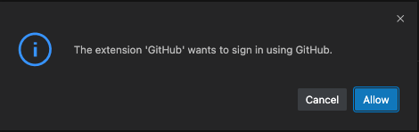
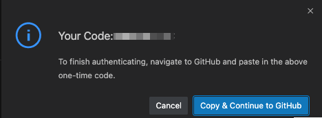

# Workshop Exercise - Installing Collections

**Read this in other languages**:
<br> [English](README.md),  [日本語](README.ja.md),  [Portugues do Brasil](README.pt-br.md),  [Française](README.fr.md), [Español](README.es.md).

## Table of Contents

- [Workshop Exercise - Installing Collections](#workshop-exercise---installing-collections)
  - [Table of Contents](#table-of-contents)
  - [Objective](#objective)
  - [Guide](#guide)
    - [Step 1 - Installing collections from the command line](#step-1---installing-collections-from-the-command-line)
      - [Preparing the exercise environment](#preparing-the-exercise-environment)
      - [Installing in the default collections path](#installing-in-the-default-collections-path)
      - [Installing in a custom collections path](#installing-in-a-custom-collections-path)
      - [Installing collections from a requirements file](#installing-collections-from-a-requirements-file)
      - [Inspecting the contents of the collection](#inspecting-the-contents-of-the-collection)
    - [Step 2 - Creating collections from the command line](#step-2---creating-collections-from-the-command-line)
      - [Initializing the Git repository](#initializing-the-git-repository)
    - [Step 3 - Adding custom roles to the collection](#step-3---adding-custom-roles-to-the-collection)
    - [Step 4 - Adding custom modules and plugins to the collection](#step-4---adding-custom-modules-and-plugins-to-the-collection)
    - [Step 5 - Building and installing collections](#step-5---building-and-installing-collections)
    - [Step 6 - Testing collections locally](#step-6---testing-collections-locally)
    - [TODO](#todo)
      - [Running the test playbook](#running-the-test-playbook)
      - [Running the local container](#running-the-local-container)
- [Takeaways](#takeaways)

## Objective

This exercise will help users understand how collections are installed, created and customized.
Covered topics:

- Demonstrate the steps involved in the installation of an Ansible Collection from the
command line using the `ansible-galaxy` utility.
- Demonstrate the steps involved in the creation of a new collection with the `ansible-galaxy`
utility.
- Demonstrate the creation of a custom role inside the newly created collection.
- Demonstrate the creation of a new custom plugin (basic Ansible module) in the newly created collection.

## Guide

### Step 1 - Installing collections from the command line

Ansible Collections can be searched and installed from Ansible Galaxy and Red Hat Automation Hub.
Once installed, a collection can be used locally and its plugins, modules, and roles can be imported
and executed in complex Ansible-based projects.

#### Preparing the exercise environment

On your Ansible control node terminal, create a directory in named `ansible-collections` and change directories into it. This directory will be used during the whole exercise.

```bash
[student@ansible-1 ~]$ mkdir ansible-collections
[student@ansible-1 ~]$ cd ansible-collections
```

Collection have two default lookup paths that are searched:

- User scoped path `/home/<username>/.ansible/collections`
- System scoped path `/usr/share/ansible/collections`

> **TIP**
>
> Users can customized the collections path by modifying the `collections_path` key in the `ansible.cfg` file or by setting the environment variable `ANSIBLE_COLLECTIONS_PATHS` with the desired search path.

#### Installing in the default collections path

First, we demonstrate how to install a collection in the **user scoped path**. For the sake of simplicity we are going to use the collection [newswangerd.collection_demo](https://galaxy.ansible.com/newswangerd/collection_demo), a basic collection created for demo purposes.

It contains basic roles and a very simple module and is a good example to understand how a collection works without getting involved in modules or roles logic.

1. Verify the `COLLECTIONS_PATH` value

```bash
[student@ansible-1 ~]$ ansible-config dump | grep COLLECTIONS_PATHS
COLLECTIONS_PATHS(default) = ['/home/student/.ansible/collections', '/usr/share/ansible/collections']
```

2. Install the collection using the command `ansible galaxy collection install` with no extra options:

```bash
[student@ansible-1 ~]$ ansible-galaxy collection install newswangerd.collection_demo
Starting galaxy collection install process
Process install dependency map
Starting collection install process
Downloading https://galaxy.ansible.com/download/newswangerd-collection_demo-1.0.11.tar.gz to /home/student/.ansible/tmp/ansible-local-19580sxf0ays1/tmpm8dxbc7a/newswangerd-collection_demo-1.0.11-d93zigt9
Installing 'newswangerd.collection_demo:1.0.11' to '/home/student/.ansible/collections/ansible_collections/newswangerd/collection_demo'
newswangerd.collection_demo:1.0.11 was installed successfully
```

#### Installing in a custom collections path

Install the collection in the current working directory using the `-p` flag followed by the custom installation path.

1. Change directories to the one created earlier `ansible-collections` if haven't done yet

```bash
[student@ansible-1 ~]$ cd ~/ansible-collections
```

2. Install the `newswangerd.collection_demo` collection in the current directory

```bash
[student@ansible-1 ~]$ ansible-galaxy collection install -p . newswangerd.collection_demo
Starting galaxy collection install process
[WARNING]: The specified collections path '/home/student/ansible-collections' is not part of the configured Ansible collections paths '/home/student/.ansible/collections:/usr/share/ansible/collections'. The installed collection will not be picked up in an Ansible run, unless within a playbook-adjacent
collections directory.
Process install dependency map
Starting collection install process
Downloading https://galaxy.ansible.com/download/newswangerd-collection_demo-1.0.11.tar.gz to /home/student/.ansible/tmp/ansible-local-22953_6kgwfum/tmp0l121xwc/newswangerd-collection_demo-1.0.11-c8a0w75g
Installing 'newswangerd.collection_demo:1.0.11' to '/home/student/ansible-collections/ansible_collections/newswangerd/collection_demo'
newswangerd.collection_demo:1.0.11 was installed successfully
```

> **NOTE**
>
> When installing on custom paths not included in the collections search path a standard warning message is issued:
>
> [WARNING]: The specified collections path '/home/<username>/my-collections' is not part of the configured Ansible collections paths
> '/home/<username>/.ansible/collections:/usr/share/ansible/collections'. The installed collection won't be picked up in an Ansible run, unless within a playbook-adjacent

The installed path follows the standard pattern `ansible_collections/<author>/<collection>`.

3. On the current directory ()`ansible-collections`), run the `tree` command to inspect the contents:

```bash
[student@ansible-1 ~]$ tree
.
└── ansible_collections
    ├── newswangerd
    │   └── collection_demo
    │       ├── docs
    │       │   └── test_guide.md
    │       ├── FILES.json
    │       ├── MANIFEST.json
    │       ├── meta
    │       │   └── runtime.yml
    │       ├── plugins
    │       │   └── modules
    │       │       └── real_facts.py
    │       ├── README.md
    │       └── roles
    │           ├── deltoid
    │           │   ├── meta
    │           │   │   └── main.yaml
    │           │   ├── README.md
    │           │   └── tasks
    │           │       └── main.yml
    │           └── factoid
    │               ├── meta
    │               │   └── main.yaml
    │               ├── README.md
    │               └── tasks
    │                   └── main.yml
    └── newswangerd.collection_demo-1.0.11.info
        └── GALAXY.yml

15 directories, 13 files
```

#### Installing collections from a requirements file

You can create a `collections/requirements.yml` file to list all the collections that you need to install to run playbooks in your Ansible project.
By adding a `collections/requirements.yml` file in your Ansible project, your team members can identify the required collections, and they can use the  `ansible-galaxy` command, mentioned previously, to manually install them. Also,
automation controller detects that file and automatically installs the collections it specifies before running your playbook

The following `collections/requirements.yml` file lists several collections to install. You can target a specific version of an Ansible Content Collection or provide local or remote `.tar` files or Git repositories as the source of the collection.

```yaml
---
collections:
  - name: community.crypto
  - name: ansible.netcommon

  - name: ansible.posix
    version: 1.2.0
  - name: cisco.intersight
    version: 1.0.27

  # - name: git@github.com:ansible-collections/community.mysql.git

  # - name: /tmp/community-dns-1.2.0.tar.gz

  # - name: http://www.example.com/redhat-insights-1.0.5.tar.gz
```

You can process the file with the `ansible-galaxy` command to install all of those collections.
Use the `--requirements-file` (or `-r`) option to provide the `requirements.yml` file to the command.

1. Let's create a `requirements.yml` file with the example content

```bash
[student@ansible-1 ~]$ echo "---
collections:
  - name: community.crypto
  - name: ansible.netcommon

  - name: ansible.posix
    version: 1.2.0
  - name: cisco.intersight
    version: 1.0.27

  # - name: git@github.com:ansible-collections/community.mysql.git

  # - name: /tmp/community-dns-1.2.0.tar.gz

  # - name: http://www.example.com/redhat-insights-1.0.5.tar.gz" > requirements.yml
[student@ansible-1 ansible-collections]$
```

2. Install the collections from the `requirements.yml` file

```bash
[student@ansible-1 ~]$ ansible-galaxy collection install -r requirements.yml
Starting galaxy collection install process
Process install dependency map
Starting collection install process
Downloading https://galaxy.ansible.com/download/ansible-posix-1.2.0.tar.gz to /home/student/.ansible/tmp/ansible-local-321171nekfxpt/tmpgcdo_qmn/ansible-posix-1.2.0-7fq6ky0x
Installing 'ansible.posix:1.2.0' to '/home/student/.ansible/collections/ansible_collections/ansible/posix'
Downloading https://galaxy.ansible.com/download/cisco-intersight-1.0.27.tar.gz to /home/student/.ansible/tmp/ansible-local-321171nekfxpt/tmpgcdo_qmn/cisco-intersight-1.0.27-g5zdsv25
ansible.posix:1.2.0 was installed successfully
Installing 'cisco.intersight:1.0.27' to '/home/student/.ansible/collections/ansible_collections/cisco/intersight'
Downloading https://galaxy.ansible.com/download/ansible-netcommon-5.1.1.tar.gz to /home/student/.ansible/tmp/ansible-local-321171nekfxpt/tmpgcdo_qmn/ansible-netcommon-5.1.1-9mwjph0f
cisco.intersight:1.0.27 was installed successfully
Installing 'ansible.netcommon:5.1.1' to '/home/student/.ansible/collections/ansible_collections/ansible/netcommon'
Downloading https://galaxy.ansible.com/download/ansible-utils-2.10.3.tar.gz to /home/student/.ansible/tmp/ansible-local-321171nekfxpt/tmpgcdo_qmn/ansible-utils-2.10.3-wso4vwam
ansible.netcommon:5.1.1 was installed successfully
Installing 'ansible.utils:2.10.3' to '/home/student/.ansible/collections/ansible_collections/ansible/utils'
Downloading https://galaxy.ansible.com/download/community-crypto-2.13.1.tar.gz to /home/student/.ansible/tmp/ansible-local-321171nekfxpt/tmpgcdo_qmn/community-crypto-2.13.1-reql88el
ansible.utils:2.10.3 was installed successfully
Installing 'community.crypto:2.13.1' to '/home/student/.ansible/collections/ansible_collections/community/crypto'
community.crypto:2.13.1 was installed successfully
```

You can also use the `ansible-galaxy collection list` command to list the collections
available in the directories specified by your current `collections_paths` Ansible configuration directive on your control node.

3. Verify your installed collections

```bash
[student@ansible-1 ansible-collections]$ ansible-galaxy collection list

# /home/student/.ansible/collections/ansible_collections
Collection                  Version
--------------------------- -------
ansible.netcommon           5.1.1
ansible.posix               1.2.0
ansible.utils               2.10.3
cisco.intersight            1.0.27
community.crypto            2.13.1
newswangerd.collection_demo 1.0.11
```

#### Inspecting the contents of the collection

Collections have a standard structure that can can hold modules, plugins, roles and playbooks.

```bash
collection/
├── docs/
├── galaxy.yml
├── plugins/
│   ├── modules/
│   │   └── module1.py
│   ├── inventory/
│   └── .../
├── README.md
├── roles/
│   ├── role1/
│   ├── role2/
│   └── .../
├── playbooks/
│   ├── files/
│   ├── vars/
│   ├── templates/
│   └── tasks/
└── tests/
```

A short description of the collection structure:

- The `plugins` folder holds plugins, modules, and module_utils that can be reused in playbooks and roles.
- The `roles` folder hosts custom roles, while all collection playbooks must be stored in the `playbooks` folder.
- The `docs` folder can be used for the collections documentation, as well as the main `README.md` file that is
  used to describe the collection and its content.
- The `tests` folder holds tests written for the collection.
- The `galaxy.yml` file is a YAML text file that contains all the metadata used in the Ansible Galaxy hub to index the collection.
  It is also used to list collection dependencies, if there are any.

When a collection is downloaded with the `ansible-galaxy collection install` two more files are installed:

- `MANIFEST.json`, holding additional Galaxy metadata in JSON format.
- `FILES.json`, a JSON object containing all the files SHA256 checksum.

### Step 2 - Creating collections from the command line

Users can create their own collections and populate them with roles, playbook, plugins and modules.
User defined collections skeleton can be created manually or it can be authored with the
`ansible-galaxy collection init` command. This will create a standard skeleton that can be
customized lately.

1. Change directories to the one created earlier `ansible-collections` if haven't done yet

2. Create the a custom collection:

```bash
[student@ansible-1 ansible-collections]$ ansible-galaxy collection init --init-path ansible_collections redhat.workshop_demo_collection
```

The `--init-path` flag is used to define a custom path in which the skeleton will be initialized.
The collection name always follows the pattern `<namespace.collection>`. The above example creates
the `workshop_demo_collection` in the `redhat` namespace.

The command created the following skeleton:

```bash
[student@ansible-1 ansible-collections]$ tree ansible_collections/redhat/workshop_demo_collection/
ansible_collections/redhat/workshop_demo_collection/
├── docs
├── galaxy.yml
├── meta
│   └── runtime.yml
├── plugins
│   └── README.md
├── README.md
└── roles

4 directories, 4 files
```

The skeleton is really minimal. Besides the template README files, a template `galaxy.yml` file is created to define Galaxy metadata.

#### Initializing the Git repository

A good practice is, necessary if we want to publish our collection in Galaxy, is to initialize
a Git repository in the collection.

```bash
[student@ansible-1 ansible-collections]$ cd ansible_collections/redhat/workshop_demo_collection
[student@ansible-1 workshop_demo_collection]$ git init .
Initialized empty Git repository in /home/student/ansible-collections/ansible_collections/redhat/workshop_demo_collection/.git/
```

> **NOTE**
>
> The `workshop_demo_collection` repository must be already present on GitHub.
> To create a new repository follow the official GitHub [documentation](https://docs.github.com/en/github/creating-cloning-and-archiving-repositories/creating-a-new-repository).

When changed, files will be added to the staging area with the `git add` and committed with the `git commit` commands.

```bash
[student@ansible-1 workshop_demo_collection]$ git add *
[student@ansible-1 workshop_demo_collection]$ git commit -m "Initial commit in my demo collection"
```

> **NOTE**
>
> When committing with `git` with not a minimal configuration on `~/.gitconfig` a standard warning message is issued:
>
> Author identity unknown
>
> *** Please tell me who you are.
>
> Run
>
>  git config --global user.email "you@example.com"
>  git config --global user.name "Your Name"
>
> to set your account's default identity.
> Omit --global to set the identity only in this repository.
>
> fatal: empty ident name (for <student@ansible-1.example.com>) not allowed

To publish the collection on GitHub a remote should be added:

```bash
[student@ansible-1 workshop_demo_collection]$ git branch -M main
[student@ansible-1 workshop_demo_collection]$ git remote add origin https://github.com/<user>/workshop_demo_collection.git
[student@ansible-1 workshop_demo_collection]$ git push --set-upstream origin main
```

Now, you are going to be authenticate it against GitHub.





### Step 3 - Adding custom roles to the collection

We will deploy a basic role that uses the next module (build in step 4) to dynamically generates greetings inside an `index.html` and build it inside an OCI image with podman. The image will be finally pushed into a customizable private registry.

> **NOTE**
>
> Change directories to the one created earlier `ansible_collections/redhat/workshop_demo_collection` if haven't done yet

1. Generate the new role skeleton using the `ansible-galaxy init role` command:

```bash
[student@ansible-1 ansible-collections]$ ansible-galaxy init --init-path roles demo_image_builder
```

> **TIP**
>
> The complete role is available in the `code/roles/tasks` folder of this exercise.

1. Create the following tasks in the `roles/demo_image_builder/tasks/main.yml` file:

```yaml
---
# tasks file for demo_image_builder
- name: Ensure podman is present in the host
  ansible.builtin.dnf:
    name: podman
    state: present
  become: true

- name: Generate greeting and store result
  demo_hello:
    name: "{{ friend_name }}"
  register: demo_greeting

- name: Create build directory
  ansible.builtin.file:
    path: "{{ build_dir_path }}"
    state: directory
    mode: 0755

- name: Copy Dockerfile
  ansible.builtin.copy:
    src: files/Dockerfile
    dest: "{{ build_dir_path }}"
    mode: 0644

- name: Copy custom index.html
  ansible.builtin.template:
    src: templates/index.html.j2
    dest: "{{ build_dir_path }}/index.html"
    mode: 0644

- name: Build and Push OCI image
  ansible.builtin.podman_image:
    name: demo-nginx
    path: "{{ build_dir_path }}"
    build:
      annotation:
        app: nginx
        function: demo
        info: Demo app for Ansible Collections workshop
      format: oci
    push: true
    force: true
    push_args:
      dest: "{{ image_registry }}/{{ registry_username }}"
```

> **NOTE**
>
> Notice the usage of the `demo_hello` module, installed in the collection, to generate the greeting string.

> **NOTE**
>
> When a collection role calls a module in the same collection namespace, the module is automatically resolved.

3. Create the following variables in the `roles/demo_image_builder/defaults/main.yml`:

> **TIP**
>
> The complete defaults file is available in the `code/roles/defaults/` folder of this exercise.

```yaml
---
# defaults file for demo_image_builder
friend_name: "John Doe"
build_dir_path: "/tmp/demo_nginx_build"
image_registry: "quay.io"
registry_username: ""
```

> **NOTE**
>
> Fill the `registry_username` with your **quay.io** username


4. Create the Containerfile used in the build process in the `roles/demo_image_builder/files/` folder:

> **TIP**
>
> The complete `Containerfile` file is available in the `code/roles/files/` folder of this exercise.

```bash
[student@ansible-1 ansible-collections]$ cat > roles/demo_nginx/files/Containerfile << EOF
FROM nginx
COPY index.html /usr/share/nginx/html
EOF
```

5. Create the `index.html.j2` file which acts as a Jinja2 template in `roles/demo_image_builder/templates/` folder:

> **TIP**
>
> The complete `index.html.j2` file is available in the `code/roles/templates/` folder of this exercise.

```bash
[student@ansible-1 ansible-collections]$ cat > roles/demo_image_builder/templates/index.html.j2 << EOF
<!doctype html>

<html lang="en">
<head>
  <meta charset="utf-8">

  <title>Ansible Collections Workshop</title>
  <meta name="description" content="Demo Nginx">
  <meta name="author" content="gsalinet@redhat.com">

  <link rel="stylesheet" href="css/styles.css?v=1.0">

</head>

<body>
  <h1>
    {{ demo_greeting.fact }}
  </h1>
</body>
</html>
EOF
```

The skeleton created by the `ansible-galaxy init` command generates a complete structure files and folder. We can clean up the unused ones:

```bash
[student@ansible-1 ansible-collections]$ rm -rf roles/demo_image_builder/{handlers,vars,tests}
```

6. Customize the `roles/demo_image_builder/meta/main.yml` file to define Galaxy metadata and potential dependencies of the role. Use this sample minimal content:

> **TIP**
>
> The complete meta file is available in the `code/roles/meta` folder of this exercise.

```yaml
galaxy_info:
  author: Ansible Automation Platform Team
  description: Basic builder role based on podman
  company: Red Hat

  license: Apache-2.0

  min_ansible_version: 2.9

  platforms:
    - name: Fedora
      versions:
      - 36
      - 37
      - 38

  galaxy_tags: ["demo", "podman", "nginx"]

dependencies: []
```

### Step 4 - Adding custom modules and plugins to the collection

Collections can be customized with different kinds of plugins and modules. For a complete list please refer to the `README.md` file in the `plugins` folder.

In this exercise we are going to create a minimal *Hello World* module and install it in the `plugins/modules` directory.

1. First, create the `plugins/modules` directory:

> **NOTE**
>
> Change directories to the one created earlier `ansible-collections` if haven't done yet

```bash
[student@ansible-1 ansible-collections]$ cd ansible_collections/redhat/workshop_demo_collection
[student@ansible-1 ansible-collections]$ mkdir plugins/modules
```

Create the `demo_hello.py` module in the new folder.

> **TIP**
>
> The module code is available in the `code/modules` folder of this exercise.

```bash
[student@ansible-1 ansible-collections]$ vim plugins/modules/demo_hello.py
```

The `demo_hello` module says Hello in different languages to custom defined users. Take your time to look at the module code and understand its behavior.

```python
#!/usr/bin/python

import random

ANSIBLE_METADATA = {
    'metadata_version': '1.0',
    'status': ['preview'],
    'supported_by': 'community'
}

DOCUMENTATION = '''
---
module: demo_hello
short_description: A module that says hello in many languages
version_added: "2.8"
description:
    - "A module that says hello in many languages."
options:
    name:
        default: John Doe
author:
    - Gianni Salinetti (@giannisalinetti)
'''

EXAMPLES = '''
# Pass in a custom name
- name: Say hello to Linus Torwalds
  demo_hello:
    name: "Linus Torwalds"
'''

RETURN = '''
fact:
  description: Hello string
  type: str
  sample: Hello John Doe!
'''

from ansible.module_utils.basic import AnsibleModule


FACTS = [
    "Hello {name}!",
    "Bonjour {name}!",
    "Hola {name}!",
    "Ciao {name}!",
    "Hallo {name}!",
    "Hei {name}!",
]


def run_module():
    module_args = dict(
        name=dict(type='str', default='John Doe'),
    )

    module = AnsibleModule(
        argument_spec=module_args,
        supports_check_mode=True
    )

    result = dict(
        changed=False,
        fact=''
    )

    result['fact'] = random.choice(FACTS).format(
        name=module.params['name']
    )

    if module.check_mode:
        return result

    module.exit_json(**result)


def main():
    run_module()


if __name__ == '__main__':
    main()
```

An Ansible module is basically an implementation of the `AnsibleModule class` created and executed in a minimal function called `run_module()`. As you can see, a module has a `main()` function, like a plain Python executable. Anyway, it is not meant to be executed independently.

### Step 5 - Building and installing collections

Once completed the creation task we can build the collection and generate a `.tar.gz` file that can be installed locally or uploaded to Galaxy.

1. From the collection folder run the following command:

```bash
[student@ansible-1 ansible-collections]$ cd ansible_collections/redhat/workshop_demo_collection
[student@ansible-1 workshop_demo_collection]$ ansible-galaxy collection build
Created collection for redhat.workshop_demo_collection at /home/student/ansible-collections/ansible_collections/redhat/workshop_demo_collection/redhat-workshop_demo_collection-1.0.0.tar.gz
[student@ansible-1 workshop_demo_collection]$ ls
docs  galaxy.yml  meta  plugins  README.md  redhat-workshop_demo_collection-1.0.0.tar.gz  roles
```

The above command will create the file `redhat-workshop_demo_collection-1.0.0.tar.gz`. Notice the semantic x.y.z versioning.

2. Once created the file can be installed in the `COLLECTIONS_PATH` to be tested locally:

```bash
[student@ansible-1 workshop_demo_collection]$ ansible-galaxy collection install redhat-workshop_demo_collection-1.0.0.tar.gz
Starting galaxy collection install process
Process install dependency map
Starting collection install process
Installing 'redhat.workshop_demo_collection:1.0.0' to '/home/student/.ansible/collections/ansible_collections/redhat/workshop_demo_collection'
redhat.workshop_demo_collection:1.0.0 was installed successfully
```

By default the collection will be installed in the `~/.ansible/collections/ansible_collections` folder. Now the collection can be tested locally.

### Step 6 - Testing collections locally

1. Create the `ansible-collections/collections_test` folder to execute the local test:

```bash
cd ~/ansible-collections
mkdir collections_test
cd collections_test
```

2. Create a basic `playbook.yml` file with the following contents:

```bash
cat > playbook.yml << EOF
---
- hosts: node2
  remote_user: root
  vars:
    image_registry: quay.io
    registry_username: <YOUR_USERNAME>
    friend_name: Heisenberg
  tasks:
    - import_role:
        name: redhat.workshop_demo_collection.demo_image_builder
EOF
```

> **TIP**
>
> Replace the `<YOUR_USERNAME>` field with a valid quay.io username.


> **NOTE**
>
> Before running the test playbook, be sure to have a valid auth token to authenticate to the registry.
> You can authenticate by running the following command and passing valid credentials.
>
> `podman login quay.io`


### TODO

#### Running the test playbook

Run the test playbook. Since some tasks require privilege escalation use the `-K` option to authenticate via sudo.

```bash
[student@ansible-1 collection_test]$ ansible-navigator run playbook.yml -m stdout
BECOME password:
[WARNING]: provided hosts list is empty, only localhost is available. Note that the implicit localhost does not match 'all'

PLAY [localhost] **************************************************************************************************************************************************************************************************

TASK [Gathering Facts] ********************************************************************************************************************************************************************************************
ok: [localhost]

TASK [redhat.workshop_demo_collection.demo_image_builder : Ensure podman is present in the host] ******************************************************************************************************************
ok: [localhost]

TASK [redhat.workshop_demo_collection.demo_image_builder : Generate greeting and store result] ********************************************************************************************************************
ok: [localhost]

TASK [redhat.workshop_demo_collection.demo_image_builder : Create build directory] ********************************************************************************************************************************
ok: [localhost]

TASK [redhat.workshop_demo_collection.demo_image_builder : Copy Dockerfile] ***************************************************************************************************************************************
ok: [localhost]

TASK [redhat.workshop_demo_collection.demo_image_builder : Copy custom index.html] ********************************************************************************************************************************
changed: [localhost]

TASK [redhat.workshop_demo_collection.demo_image_builder : Build and Push OCI image] ***************************************************************************************************************************************
changed: [localhost]

PLAY RECAP ********************************************************************************************************************************************************************************************************
localhost                  : ok=7    changed=2    unreachable=0    failed=0    skipped=0    rescued=0    ignored=0
```

#### Running the local container

Locally test the built container image with podman to demonstrate the expected behavior
of the collection's module and role.

```bash
podman run -d --rm -d -p 8080:80 localhost/demo-nginx
```

Test the nginx web server and inspect the body section to find the generated string in the h1 section.

```bash
$ curl localhost:8080
<!doctype html>

<html lang="en">
<head>
  <meta charset="utf-8">

  <title>Ansible Collections Workshop</title>
  <meta name="description" content="Demo Nginx">
  <meta name="author" content="gsalinet@redhat.com">

  <link rel="stylesheet" href="css/styles.css?v=1.0">

</head>

<body>
  <h1>
    Hei Heisenberg!
  </h1>
</body>
</html>
```

# Takeaways

- Collections can be installed from Galaxy of from Red Hat Automation Hub. Default collections search paths or custom paths can be used.

- Collections can be created using the `ansible-galaxy collection init` command. Users can develop collections contents accordingly to their needs and business logic.

- Collections plugins can be either any kind of Ansible plugins or modules. Modules are often developed inside collection to create an autonomous lifecycle from the main Ansible upstream.

- Collection roles can use local collections plugins and modules.

---
**Navigation**
<br>
[Previous Exercise](../3.1-execution-environments) - [Next Exercise](../3.3-gitops-automation)

[Click here to return to the Ansible for Red Hat Enterprise Linux Workshop](../README.md#section-1---ansible-engin
