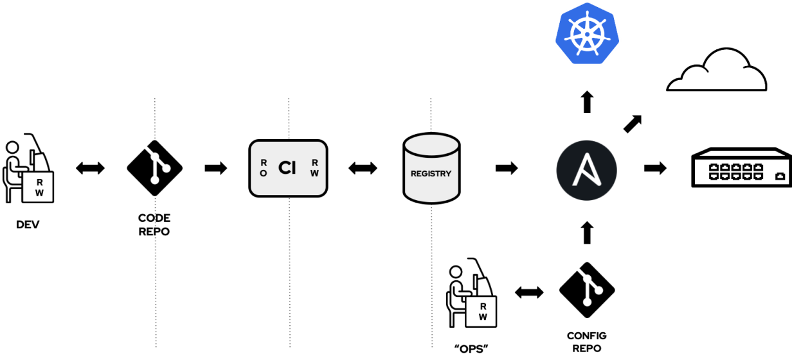
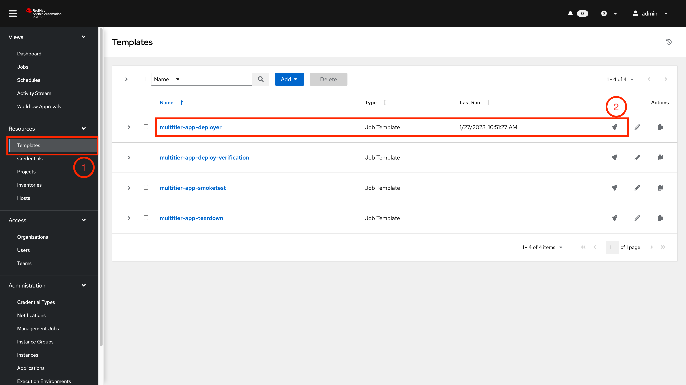
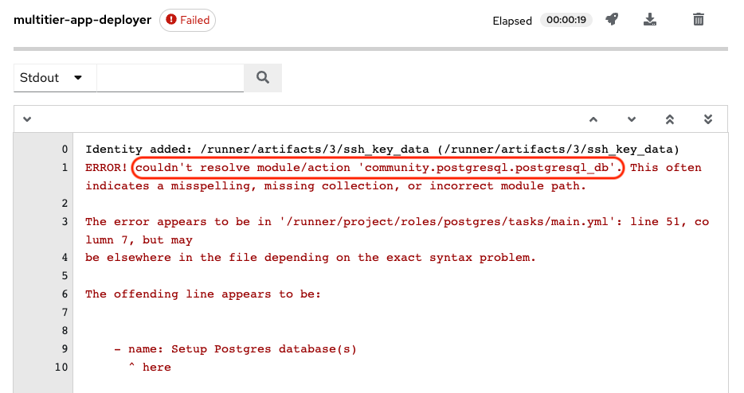

# Workshop Exercise - Check the Prerequisites

**Read this in other languages**:
  [English](README.md),  [日本語](README.ja.md),  [Portugues do Brasil](README.pt-br.md),  [Française](README.fr.md), [Español](README.es.md).

## Table of Contents

- [Workshop Exercise - Check the Prerequisites](#workshop-exercise---check-the-prerequisites)
  - [Table of Contents](#table-of-contents)
  - [Objective](#objective)
  - [Introduction](#introduction)
    - [Understanding Execution Environments](#understanding-execution-environments)
    - [Understanding GitOps](#understanding-gitops)
  - [Guide](#guide)
    - [Architecture](#architecture)
    - [Pipeline to Build Execution Environment](#pipeline-to-build-execution-environment)
      - [Objective](#objective-1)
    - [Step 1 - Investigating the cause of a failed job run](#step-1---investigating-the-cause-of-a-failed-job-run)

## Objective

This workshop aims to provide participants with an understanding of how EEs can be customized, created, and pushed to a central image registry using Openshift Pipelines. The following topics will be covered:

- Demonstrating the steps involved in customizing EEs using a Git repository.
- Demonstrating the steps involved in creating EEs using Openshift Pipelines.
- Demonstrating the steps involved in scanning and pushing EEs to an image registry (Private Ansible Automation Hub).
- Demonstrating the steps involved in using custom EEs pushed to the registry to run job templates from the Ansible Automation Controller.

## Introduction

The use of containers in automation is driven by the principles of reproducibility and consistency. Red Hat Ansible Automation Platform (AAP) also incorporates these principles through the use of YAML-formatted playbooks, allowing for uniform setup and configuration of thousands of instances.

By utilizing containers and maintaining a single source of truth, organizations can utilize the GitOps operational framework to apply DevOps best practices, such as version control, collaboration, compliance, and CI/CD tooling, to infrastructure automation.

In this workshop, we will explore the process of customizing, creating, and pushing EEs to a central image registry using OpenShift Pipelines. Participants will learn how to use a Git repository to customize EEs, create EEs using OpenShift Pipelines, scan and push EEs to a central image registry, and run job templates from the Automation Controller using custom EEs.

### Understanding Execution Environments

Automation Execution Environments (EEs) are container images on which all automation in Red Hat Ansible Automation Platform is run. They provide a defined, consistent, and portable environment for executing automation, and simplify the administration of Ansible Automation Platform for the platform administrator.

The best way to build EEs is by relying on a new tool provided by Red Hat® Ansible® Automation Platform, the `ansible-builder` command.

### Understanding GitOps

Infrastructure automation is essential to meet the demands of modern infrastructure. GitOps is a method used to automate the process of provisioning infrastructure, in this case, custom EEs. Similar to how developers use application source code, operations teams that adopt GitOps use configuration files stored as code (IaC - Infrastructure as Code) to generate a consistent infrastructure environment every time it is deployed.

The GitOps workflow consists of four key components:

- Git repository
- CI/CD pipeline
- A deployment tool
- A monitoring system

The Git repository serves as the source of truth for the configuration and code, the CI/CD pipeline is responsible for building, testing, and deploying the application, the deployment tool manages the application resources in the target environment, and the monitoring system tracks the status and performance of the deployed application.

## Guide

### Architecture

Pending

### Pipeline to Build Execution Environment

#### Objective

Using your expertise in OpenShift and Ansible Automation Platform, you will investigate the issue and identify the root cause. You will then implement a solution to ensure successful deployments in the future.

### Step 1 - Investigating the cause of a failed job run

1. Login to your Ansible Automation Controller
Point your browser to the URL you were given, similar to `https://student<X>.<workshopname>.demoredhat.com` (replace `<X>` with your student number and `workshopname` with the name of your current workshop) and log in as `admin`. The password will be provided by the instructor.

2. Navigate to the **Templates** menu and chose the failing **Job Template** `multitier-app-deployer`

3. Launch the top Template `multitier-app-deployer` via the Rocket Icon (🚀)

4. You will be taken to the **Output** screen, where after a short delay, as the Project Syncs and the Execution Environment starts, you will see a failure very early in the process.

> **NOTE**
>
>  The `community.postgresql.postgresql_db` module is used in the playbook shown in the error, which is missing in the default execution environment.
>

There are two ways that a missing collection error like this can be resolved.
Both involve adding the dependency to a `requirements.yml` file in 1 of 2 locations.

- Add it to the playbook repository itself, and the Execution Environment will dynamically download it at runtime.
  - This is, arguably, an easy but inefficient fix, which will download it every single Job run
  - It introduces an external dependency where an outage could cause job failure
- Add the dependency to the Execution Environment build repository

Wanting a more permanent fix, avoiding dynamic downloads we will choose the latter.

> **NOTE**
>
> In the development stage it is quite common to add collections in the deployer repository `requirements.yml` and additionally this can be used to extend an existing Execution Environment. There is a strong argument to be made that these should either come from a known good source such as Ansible Galaxy or be brought "behind the firewall" and hosted internally.
>

5.

---
**Navigation**
 
[Previous Exercise](../1.9-execution-environments) - [Next Exercise](../2.1-intro/)

[Click here to return to the Ansible for Red Hat Enterprise Linux Workshop](../README.md#section-1---ansible-engine-exercises)
